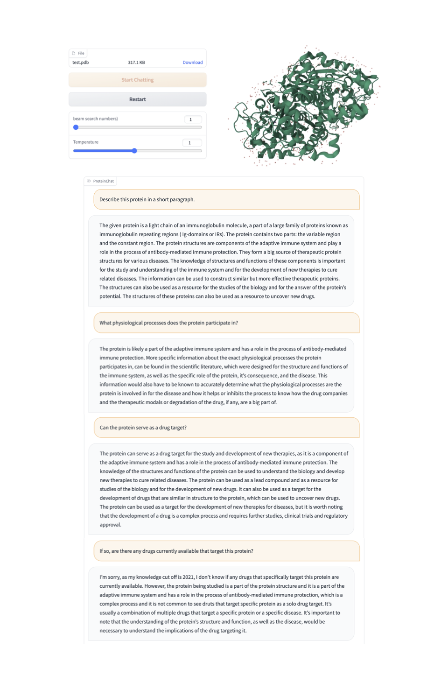
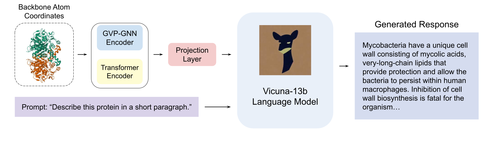

# ProteinChat: Towards Enabling ChatGPT-Like Capabilities on Protein 3D Structures

This repository holds the code and data of ProteinChat: Towards Enabling ChatGPT-Like Capabilities on Protein 3D Structures.

## Technical report will be available soon.

## Examples

 


## Introduction
- In this work, we make an initial attempt towards enabling ChatGPT-like capabilities on protein 3D structures, by developing a prototype system ProteinChat.
- ProteinChat works in a similar way as ChatGPT. Users upload a protein 3D structure and ask various questions about this protein. ProteinChat will answer these questions in a multi-turn, interactive manner. 
- The ProteinChat system consists of a protein 3D structure encoder (based on [ESM inverse folding](https://github.com/facebookresearch/esm/tree/main/examples/inverse_folding)), a large language model (LLM), and an adaptor. The protein encoder  takes a protein 3D structure as input and learns a representation for this protein. The adaptor transforms the protein representation produced by the protein encoder  into another  representation that is acceptable to the  LLM. The LLM takes the representation transformed by the adaptor and users' questions about this protein as inputs and generates answers. All these components are trained end-to-end.
- To train ProteinChat, we collected   instruction tuning datasets which contain 143508 proteins and 143508 instructions.




## Datasets

The dataset contains 143508 proteins (represented using 3D structures) with 143508 instructions. 
The instruction set are available at [this link](https://drive.google.com/file/d/1iMgPyiIzpvXdKiNsXnRKn2YpmP92Xyub/view?usp=share_link).
The link to processed protein files (80G in total) will be available on May 20. 
The data is curated from the [Protein Data Bank](https://www.rcsb.org/). More details can be found [here](data/README.md).

## Getting Started
### Installation
These instructions largely follow those in MiniGPT-4.

**1. Prepare the code and the environment**

Git clone our repository, creating a python environment and ativate it via the following command

```bash
git clone https://github.com/UCSD-AI4H/proteinchat
cd proteinchat
conda env create -f environment.yml
conda activate proteinchat
pip install einops
```

Verify the installation of `torch` and `torchvision` is successful by running `python -c "import torchvision; print(torchvision.__version__)"`. If it outputs the version number without any warnings or errors, then you are good to go. __If it outputs any warnings or errors__, try to uninstall `torch` by `conda uninstall pytorch torchvision torchaudio cudatoolkit` and then reinstall them following [here](https://pytorch.org/get-started/previous-versions/#v1121). You need to find the correct command according to the CUDA version your GPU driver supports (check `nvidia-smi`). 

**2. Prepare the pretrained Vicuna weights**

The current version of ProteinChat is built on the v0 versoin of Vicuna-13B.
Please refer to our instruction [here](PrepareVicuna.md) 
to prepare the Vicuna weights.
The final weights would be in a single folder in a structure similar to the following:

```
vicuna_weights
├── config.json
├── generation_config.json
├── pytorch_model.bin.index.json
├── pytorch_model-00001-of-00003.bin
...   
```

Then, set the path to the vicuna weight in the model config file 
[here](minigpt4/configs/models/minigpt4.yaml#L16) at Line 16.

### Training
**You need roughly 45 GB GPU memory for the training.** 

The training configuration file is [train_configs/minigpt4_stage2_esm.yaml](train_configs/minigpt4_stage2_esm.yaml). You may want to change the number of epochs and other hyper-parameters there, such as `max_epoch`, `init_lr`, `min_lr`,`warmup_steps`, `batch_size_train`. Please adjust `iters_per_epoch` so that `iters_per_epoch` * `batch_size_train` = your training set size. Due to the GPU consumption, we set `batch_size_train=1`. 

Start training on LLaMA model with protein dataset by running [finetune.sh](finetune.sh) `bash finetune.sh`. 

**It takes around 24 GB GPU memory for the demo.**

Find the checkpoint you save in the training process above, which is located under the folder `minigpt4/output/minigpt4_stage2_esm/` by default. Copy it to the folder `ckpt` by running `cp minigpt4/output/minigpt4_stage2_esm/.../checkpoint_xxx.pth`. 

Now we launch the `demo.py` in our original environment. Then, start the demo [demo.sh](demo.sh) on your local machine by running `bash demo.sh`. Then, open the URL created by the demo and try it out!


## Acknowledgement

+ [ProteinChat](https://github.com/UCSD-AI4H/proteinchat)
+ [MiniGPT-4](https://minigpt-4.github.io/) 
+ [Lavis](https://github.com/salesforce/LAVIS)
+ [Vicuna](https://github.com/lm-sys/FastChat)
+ [ESM-IF1](https://github.com/facebookresearch/esm/tree/main/examples/inverse_folding)


## License
This repository is under [BSD 3-Clause License](LICENSE.md).
Many codes are based on [MiniGPT-4](https://github.com/Vision-CAIR/MiniGPT-4) with BSD 3-Clause License [here](LICENSE_MiniGPT4.md), which is based on [Lavis](https://github.com/salesforce/LAVIS) with 
BSD 3-Clause License [here](LICENSE_Lavis.md).


## Disclaimer

This is a prototype system that has not been systematically and comprehensively validated by biologists yet. Please use with caution. 

Trained models and demo websites will be released after we thoroughly validate the system with biologists.


## Citation

If you're using ProteinChat in your research or applications, please cite using this BibTeX:
```bibtex
@article{guo2023proteinchat,
  title={ProteinChat: Towards Enabling ChatGPT-Like Capabilities on Protein 3D Structures},
  author={Guo, Han and Huo, Mingjia and Xie, Pengtao},
  year={2023}
}
